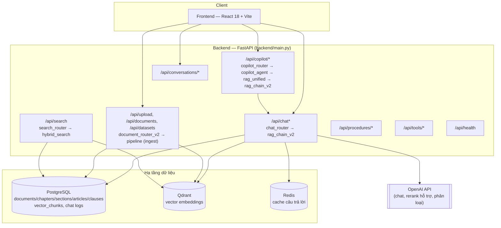
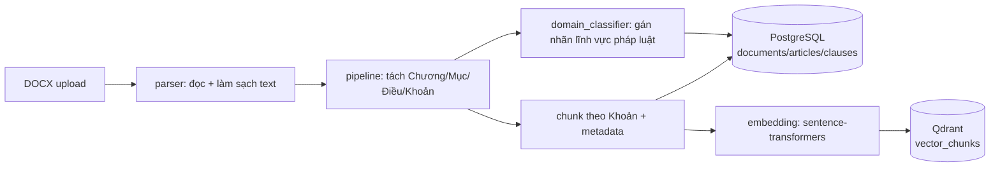

# Government AI Copilot — Trợ lý hành chính & RAG văn bản pháp luật

Hệ thống RAG (Retrieval-Augmented Generation) cho tra cứu văn bản pháp luật và hỗ trợ nghiệp vụ hành chính. Kết hợp **PostgreSQL** (dữ liệu quan hệ + full-text search), **Qdrant** (vector search), **Redis** (cache), **hybrid retrieval** (semantic + keyword → RRF → rerank) và **OpenAI API** cho sinh câu trả lời. Giao diện web tiếng Việt bằng React/Vite.

---

## 1. Kiến trúc tổng quan



### Thành phần chính

| Thành phần | Vai trò |
|---|---|
| **Frontend** (`frontend/src`) | React 18 + Vite + Tailwind. Gọi `/api/chat/stream` (SSE), quản lý hội thoại, upload tài liệu, hiển thị nguồn trích dẫn. |
| **FastAPI app** (`backend/main.py`) | Điểm vào duy nhất; khởi tạo PostgreSQL, warm-up model embedding/reranker/intent, mount toàn bộ router. |
| **`rag_chain_v2`** | Pipeline chat chính: hiểu câu hỏi → chọn chiến lược retrieval → hybrid search → sinh câu trả lời bằng LLM → kiểm chứng/chống ảo giác. |
| **`copilot_agent` + `rag_unified`** | Lớp Copilot: phát hiện intent, điều phối giữa `rag_chain_v2` và các tool khác (tóm tắt, soạn thảo, đối chiếu), chuẩn hoá output cho `/api/copilot`. |
| **`retrieval/hybrid_retriever`** | Truy hồi lai: vector search (Qdrant) + keyword/FTS (PostgreSQL) → hợp nhất bằng RRF → rerank bằng cross-encoder. |
| **`pipeline/`** | Ingestion: DOCX → parse → tách cấu trúc Chương/Mục/Điều/Khoản → chunk → embedding → ghi Qdrant + PostgreSQL. |
| **`database/models.py`** | ORM (SQLAlchemy async): `Document`, `Chapter`, `Section`, `Article`, `Clause`, `VectorChunk`, log hội thoại. |
| **`cache/redis_cache.py`** | Cache câu trả lời theo hash câu hỏi đã chuẩn hoá (TTL cấu hình được). |
| **`memory/`** | Lưu ngữ cảnh hội thoại (tài liệu/chủ đề đang nói tới) để xử lý câu hỏi nối tiếp. |

---

## 2. Luồng ingestion (đưa văn bản vào hệ thống)



Điểm vào: `pipeline/ingestor.py`, thường được gọi qua `POST /api/upload` (`routers/document_router_v2.py`).

## 3. Luồng truy hồi (hybrid retrieval)

`retrieval/hybrid_retriever.py` chạy song song hai nhánh rồi hợp nhất:

- **Vector search** (`vector_retriever.py`) — tìm kiếm ngữ nghĩa trên Qdrant, có thể lọc theo lĩnh vực pháp luật / số hiệu văn bản.
- **Keyword search** (`keyword_retriever.py`) — full-text search trên PostgreSQL (`tsvector`), fallback `ILIKE`.
- **Hợp nhất**: Reciprocal Rank Fusion (RRF) giữa hai nguồn; có nhánh lookup trực tiếp khi câu hỏi nêu rõ số Điều/số văn bản.
- **Rerank** (`reranker.py`) — cross-encoder (`BAAI/bge-reranker-v2-m3`, có fallback), sau đó điều chỉnh theo mức khớp lĩnh vực và đa dạng hoá theo Điều.

## 4. Luồng chat production (`rag_chain_v2`)

`routers/chat_router.py` expose `POST /api/chat` và `POST /api/chat/stream`. Ở mức kiến trúc, `rag_query()`:

1. Hiểu câu hỏi (intent, lĩnh vực pháp luật, cờ điều khiển retrieval).
2. Kiểm tra cache (Redis) theo câu hỏi gốc.
3. Chọn chiến lược truy hồi (tra cứu trực tiếp / semantic / multi-query) rồi gọi `hybrid_search`.
4. Ghép ngữ cảnh theo Điều, sinh câu trả lời bằng OpenAI API.
5. Kiểm chứng: đối chiếu Điều/Khoản trích dẫn, chống ảo giác, fallback khi câu trả lời không đủ căn cứ.
6. Ghi log hội thoại, cập nhật cache.

`/api/copilot/*` (`copilot_agent`) là lớp bọc phía trên: phát hiện intent trước, rồi định tuyến sang `rag_chain_v2` (qua `rag_unified`) hoặc các tool nghiệp vụ khác (tóm tắt, soạn thảo văn bản, đối chiếu tài liệu) trong `services/` và `tools/`.

---

## 5. Cấu trúc thư mục

```
backend/
  main.py                 # FastAPI entry-point, mount router, lifespan warmup
  app/
    routers/              # HTTP endpoints (chat, copilot, documents, search, ...)
    services/              # Business logic: rag_chain_v2, query understanding, intent, validation
    agents/                # copilot_agent — điều phối intent/tool/RAG
    retrieval/              # hybrid search, vector/keyword retriever, reranker
    pipeline/               # ingestion: parse → structure → chunk → embed → store
    database/               # SQLAlchemy models + session
    cache/                  # Redis cache
    memory/                 # ngữ cảnh hội thoại
    tools/                  # tool LLM: tóm tắt, trích xuất, soạn thảo, phân loại
    parser/                 # đọc file DOCX
    models/                 # Pydantic schemas (request/response)
    intent_patterns/        # cấu hình định tuyến intent (YAML)
    config.py               # cấu hình tập trung (đọc từ biến môi trường)
frontend/
  src/
    pages/ChatPage.jsx       # màn hình chat chính
    components/              # ChatInput, ChatMessage, Sidebar, UploadModal, ...
    api/client.js             # gọi API backend
docker-compose.yml          # PostgreSQL + Qdrant + Redis (hạ tầng, không có Dockerfile cho app)
```

---

## 6. Tech stack

| Lớp | Công nghệ |
|---|---|
| Frontend | React 18, Vite, Tailwind, react-markdown |
| Backend | FastAPI, Uvicorn, SQLAlchemy (async) + asyncpg, Alembic |
| LLM | OpenAI API (`OPENAI_MODEL`, mặc định `gpt-4o-mini`; đổi được qua `OPENAI_BASE_URL`) |
| Embedding | sentence-transformers — `keepitreal/vietnamese-sbert` (fallback multilingual-MiniLM) |
| Rerank | `BAAI/bge-reranker-v2-m3` (FlagEmbedding), fallback CrossEncoder |
| Intent (tuỳ chọn) | PhoBERT fine-tune cục bộ, bật/tắt qua `INTENT_MODEL_ENABLED` |
| Vector DB | Qdrant |
| Cache | Redis |
| Database | PostgreSQL (asyncpg), full-text search qua `tsvector` |

---

## 7. Hạ tầng

`docker-compose.yml` chỉ định nghĩa 3 service hạ tầng: **PostgreSQL 16**, **Qdrant**, **Redis 7** — không có Dockerfile cho backend/frontend; hai phần này chạy trực tiếp (Uvicorn / Vite dev server hoặc build tĩnh).
