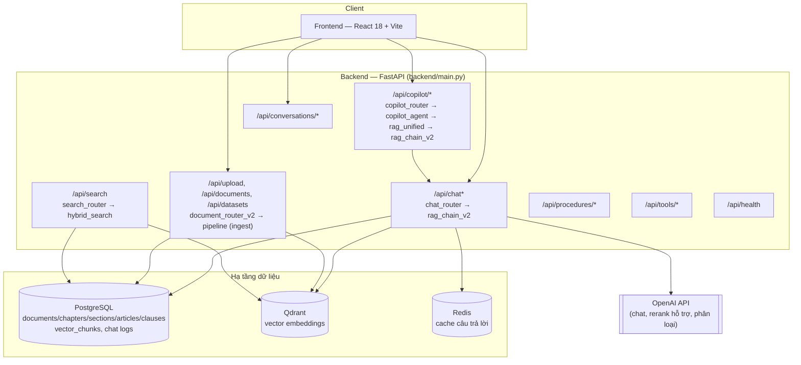
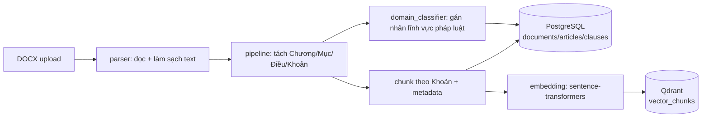

# Government AI Copilot — Trợ lý hành chính & RAG văn bản pháp luật

Hệ thống RAG (Retrieval-Augmented Generation) cho tra cứu văn bản pháp luật và hỗ trợ nghiệp vụ hành chính. Kết hợp **PostgreSQL** (dữ liệu quan hệ + full-text search), **Qdrant** (vector search), **Redis** (cache), **hybrid retrieval** (semantic + keyword → RRF → rerank) và **OpenAI API** cho sinh câu trả lời. Giao diện web tiếng Việt bằng React/Vite.

---

## 1. Kiến trúc tổng quan

### Thành phần chính

| Thành phần | Vai trò |
|---|---|
| **Frontend** (`frontend/src`) | React 18 + Vite + Tailwind. Gọi `/api/chat/stream` (SSE), quản lý hội thoại, upload tài liệu, hiển thị nguồn trích dẫn. |
| **FastAPI app** (`backend/main.py`) | Điểm vào duy nhất; khởi tạo PostgreSQL, warm-up model embedding/reranker/intent, mount toàn bộ router. |
| **`rag_chain_v2`** | Pipeline chat chính: hiểu câu hỏi → chọn chiến lược retrieval → hybrid search → sinh câu trả lời bằng LLM → kiểm chứng/chống ảo giác. |
| **`copilot_agent` + `rag_unified`** | Lớp Copilot: phát hiện intent, điều phối giữa `rag_chain_v2` và các tool khác (tóm tắt, soạn thảo, đối chiếu), chuẩn hoá output cho `/api/copilot`. |
| **`retrieval/hybrid_retriever`** | Truy hồi lai: vector search (Qdrant) + keyword/FTS (PostgreSQL) → hợp nhất bằng RRF → rerank bằng cross-encoder. |
| **`pipeline/`** | Ingestion: DOCX → parse → tách cấu trúc Chương/Mục/Điều/Khoản → chunk → embedding → ghi Qdrant + PostgreSQL. |
| **`database/models.py`** | ORM (SQLAlchemy async): `Document`, `Chapter`, `Section`, `Article`, `Clause`, `VectorChunk`, log hội thoại. |
| **`cache/redis_cache.py`** | Cache câu trả lời theo hash câu hỏi đã chuẩn hoá (TTL cấu hình được). |
| **`memory/`** | Lưu ngữ cảnh hội thoại (tài liệu/chủ đề đang nói tới) để xử lý câu hỏi nối tiếp. |

---

## 2. Luồng ingestion (đưa văn bản vào hệ thống)

Điểm vào: `pipeline/ingestor.py`, thường được gọi qua `POST /api/upload` (`routers/document_router_v2.py`).

## 3. Retrieval — các kỹ thuật đã dùng

Danh sách kỹ thuật đang chạy trong production:

- **Hybrid search (vector + keyword)** — vector search ngữ nghĩa trên Qdrant song song với full-text search trên PostgreSQL, fallback so khớp gần đúng khi thiếu chỉ mục.
- **Reciprocal Rank Fusion (RRF)** — hợp nhất thứ hạng giữa hai nguồn vector và keyword.
- **Direct lookup theo số Điều / số văn bản** — khi câu hỏi nêu rõ mốc tra cứu, truy vấn thẳng PostgreSQL thay vì qua semantic search.
- **Rerank bằng cross-encoder** — chấm lại điểm các passage sau khi hợp nhất (model `BAAI/bge-reranker-v2-m3`, có fallback).
- **Multi-query expansion** — *không phải* decomposition câu hỏi phức hợp thành nhiều câu con, mà là viết lại câu hỏi gốc thành 2–3 biến thể để tăng recall từ khoá, retrieval từng biến thể rồi gộp khử trùng lặp.
- **Parent–child retrieval** — chunk nhỏ theo Khoản để tìm chính xác, nhưng trả ngữ cảnh theo Điều (cha) để đủ căn cứ pháp lý; khi kết quả chỉ có vài Khoản rời rạc, hệ thống lấy bổ sung toàn bộ Khoản còn thiếu của các Điều điểm cao nhất rồi gom lại theo Điều trước khi đưa vào prompt.
- **Domain / topic filtering** — lọc theo lĩnh vực pháp luật khi câu hỏi xác định được domain; sau rerank còn hạ điểm các passage lệch chủ đề.
- **Subject-anchor retry (neo chủ đề)** — khi kết quả không khớp các từ khoá chủ thể trích từ câu hỏi, thử lại retrieval với câu truy vấn neo theo chủ đề đó.
- **Amendment expansion** — với văn bản dạng sửa đổi/bổ sung, mở rộng lấy thêm passage từ văn bản gốc/liên quan.
- **Diversify & dynamic top-N theo Điều** — cân bằng số Điều khác nhau trong kết quả thay vì để một Điều chiếm hết top-K.

## 4. Luồng chat production (`rag_chain_v2`)

`routers/chat_router.py` expose `POST /api/chat` và `POST /api/chat/stream`. Ở mức kiến trúc, `rag_query()`:

1. Hiểu câu hỏi (intent, lĩnh vực pháp luật, cờ điều khiển retrieval).
2. Kiểm tra cache (Redis) theo câu hỏi gốc.
3. Chọn chiến lược truy hồi (tra cứu trực tiếp / semantic / multi-query) rồi gọi `hybrid_search`.
4. Ghép ngữ cảnh theo Điều, sinh câu trả lời bằng OpenAI API.
5. Kiểm chứng: đối chiếu Điều/Khoản trích dẫn, chống ảo giác, fallback khi câu trả lời không đủ căn cứ.
6. Ghi log hội thoại, cập nhật cache.

`/api/copilot/*` (`copilot_agent`) là lớp bọc phía trên: phát hiện intent trước, rồi định tuyến sang `rag_chain_v2` (qua `rag_unified`) hoặc các tool nghiệp vụ khác (tóm tắt, soạn thảo văn bản, đối chiếu tài liệu) trong `services/` và `tools/`.

---

## 5. Tech stack

| Lớp | Công nghệ |
|---|---|
| Frontend | React 18, Vite, Tailwind, react-markdown |
| Backend | FastAPI, Uvicorn, SQLAlchemy (async) + asyncpg, Alembic |
| LLM | OpenAI API (`OPENAI_MODEL`, mặc định `gpt-4o-mini`; đổi được qua `OPENAI_BASE_URL`) |
| Embedding | sentence-transformers — `keepitreal/vietnamese-sbert` (fallback multilingual-MiniLM) |
| Rerank | `BAAI/bge-reranker-v2-m3` (FlagEmbedding), fallback CrossEncoder |
| Intent (tuỳ chọn) | PhoBERT fine-tune cục bộ, bật/tắt qua `INTENT_MODEL_ENABLED` |
| Vector DB | Qdrant |
| Cache | Redis |
| Database | PostgreSQL (asyncpg), full-text search qua `tsvector` |
